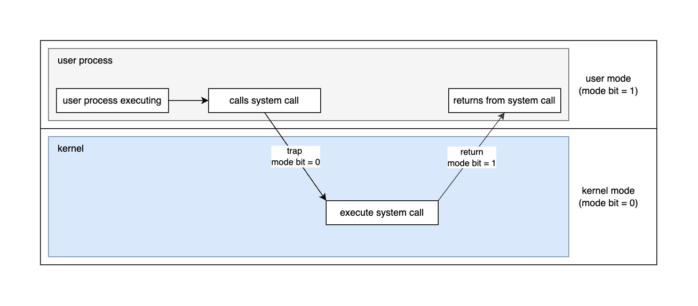

# Dual Mode Operation

## introduction
- Hardware provides at least two modes:
	1. Kernel Mode (or "supervisor" / "protected" mode)
	2. User Mode
- Certain operations are **prohibited** when running in user mode
	- e.g. Changing the page table pointer
- Carefully controlled transitions between user mode and kernel mode
	- System calls, interrupts, exceptions
	

	
	Having dual mode operation allow us to protect hardware.

## UNIX OS Structure

