# Multiplexing
## multiplexing intuition
### multiplexing is an idea of time slicing

### multiplexing share all non-CPU resources

- All vCPU's share non-CPU resources
	- Memory, I/O Devices
- Each thread can read/write memory
	- Perhaps data of others
	- can overwrite OS? => YES if not protected.
- Unusable? => 实际上早期确实可以用，并且出现了很多问题
	- This approach is used in
		- Very early days of computing
		- Embedded applications
		- MacOS 1-9/Windows 3.1 (switch only with voluntary yield)
			- 在Windows 3.1上面写一个死循环，就会导致所有其他程序都停掉
		- Windows 95-ME (switch with yield or timer)
- IT IS RISKY!!!
> [Yield (multithreading)](https://en.wikipedia.org/wiki/Yield_(multithreading)) 
> In computer science, **yield**（**让步**） is an action that occurs in a computer program during multithreading, of forcing a processor to relinquish control of the current running thread, and sending it to the end of the running queue, of same scheduling priority.
> “强制处理器放弃对于当前正在运行的线程的控制权，并将其发送到相同优先级的运行队列的末尾”

## Risks of Multiplexing without protection
- Operating System must protect itself from user programs
	- Reliability: compromising the operating system generally causes it to crash
	- Security: limit the scope of what threads can do
	- Privacy: limit each thread to the data it is permitted to access
	- Fairness: each thread should be limited to its appropriate share of system resources (CPU time, memory, I/O, etc)
- OS must protect User programs from one another
	- Prevent threads owned by one user from impacting threads owned by another user
	- Example: prevent one user from stealing secret information from another user

## Base and Bond (B&B) protection
a simple protect in early days using Base and Bond register.

We use Base register and Bound register to check if the program address is valid. If it's valid, the code can continue to run.

> How expensive to do this?
> - We can do base and bound check in parallel.

> How to change base and bound?
> - Only If I'm in kernel mode, can I change base and bound. So Only operating system can modify it, so it can protect program.

another implementation look like this:

TBD