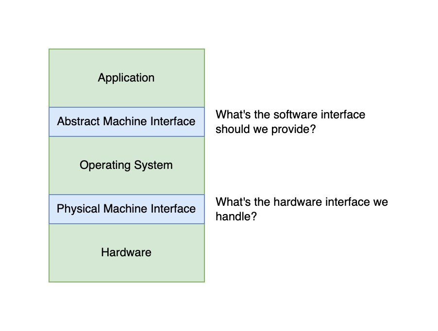

# Complexity
复杂性的来源：
- 每台电脑都有不同的硬件
	- CPU
	- memory，disk
	- devices
		- 鼠标，键盘，传感器，相机，指纹输入......
	- networking environment
		- Cable, DSL, Wireless, Firewalls
问题：
- Does the programmer need to write a single program that performs many independent activities? --> YES
- Does every program have to be altered for every piece of hardware? --> I HOPE NOT
- Does a faulty program crash everything? -->VERY BAD
- Does every program have access to all hardware? --> DON'T DO THIS

# OS Abstracts underlying hardware
- Processor => Thread
- Memory => Address Space
- Disks, SSDs, ... => Files
- Networks => Sockets
- Machines => Processes

Hardware --> PMI --> Operating System --> AMI --> Application

- The hardware provides the physical resources, which are accessed through the PMI.
- The operating system uses the PMI to manage the hardware resources and presents an abstract interface (AMI) to the application.
- The application interacts with the operating system through the AMI, requesting services and accessing the underlying hardware resources.
Operating System处理了hardware的复杂性，让程序员可以对其编程。

